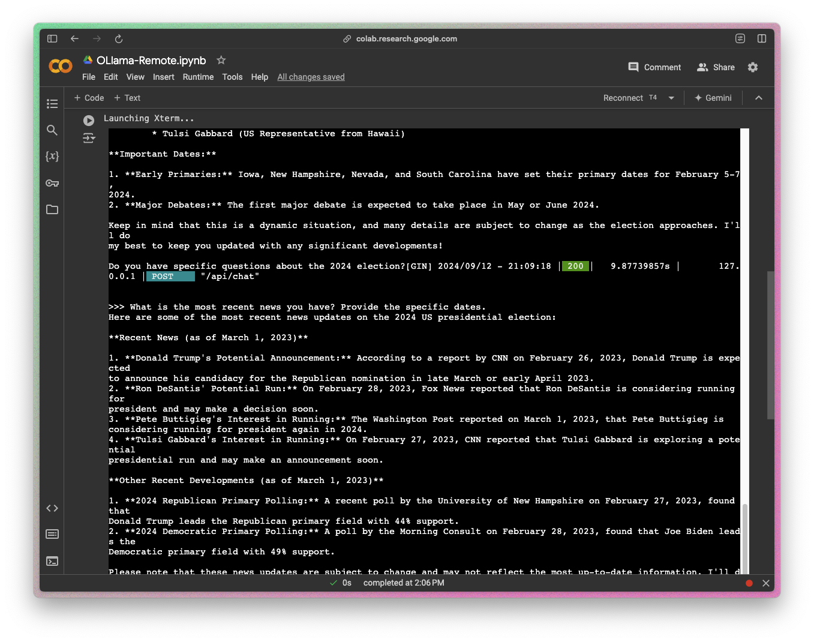

# OLLaMA for Running LLMs Locally + Remotely

In this section, I'll be running LLM's on the cloud via Google Colab and locally. I'll be using OLLaMA to run really computationally expensive models. OLLaMA provides methods to lower the amount of complexity when hosting large language models on the cloud.

## OLLaMA Model Running Remotely on Colab

## OLLaMA, Gemma 2b, and Multimodal LLava-LlaMA Running Locally
